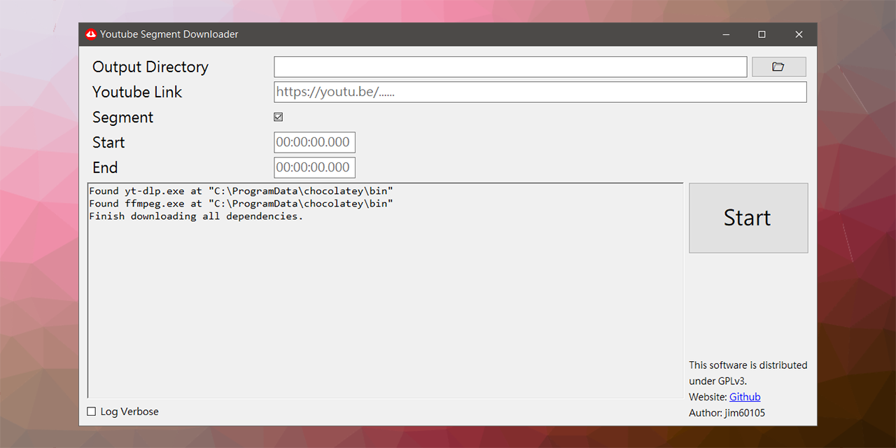

# Youtube Segment Downloader

> The software can only be run on Windows x64 platforms.

## Feature

Download Youtube video in **segment**.

In detail, you can download only one segment in the middle of the video instead of downloading the whole video.

This software is built on yt-dlp and FFmpeg. If you don't have them installed, this software will download them automatically at startup.

## Install

Get the latest release: [Github Release](https://github.com/jim60105/YoutubeSegmentDownloader/releases/latest)

Install with the setup.exe

- Checking upgrade automatically when this software is started
- Setup will install .NET 6.0 Runtime for you
- Setting shortcuts on the Desktop and Start Up Menu

Or you can run YoutubeSegmentDownloader.exe directly with .NET 6.0 runtime.

## LICENSE

This software is distributed under **GPLv3**.\
Website: <https://github.com/jim60105/YoutubeSegmentDownloader>\
Author: jim60105

This software uses **FFmpeg** licensed under the **GPLv3**.\
FFmpeg binary distributions will be downloaded from [here](https://github.com/GyanD/codexffmpeg/releases/tag/5.0).\
FFmpeg source code can be found [here](https://github.com/FFmpeg/FFmpeg/commit/390d6853d0).

This software uses **yt-dlp** licensed under the **Unlicense License**.\
yt-dlp binary distribution will be downloaded from [here](https://github.com/yt-dlp/yt-dlp/releases/latest).

This software uses **Beautiful Flat Icons** licensed under the **GPLv2**.\
Icon source can be found [here](https://www.elegantthemes.com/blog/freebie-of-the-week/beautiful-flat-icons-for-free).
