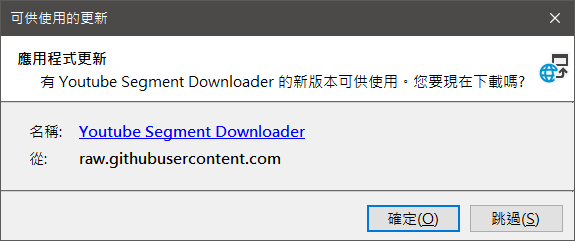

# Youtube Segment Downloader

## What's this?

A lifesaver for anyone who is doing video clipping/translating or any need to download segments from Youtube.

[](https://github.com/jim60105/YoutubeSegmentDownloader/releases/latest)


> The software can only be run on Windows x64 platforms.

## Feature

Download Youtube video in **segment**.

In detail, you can download only one segment in the middle of the video instead of downloading the whole video.

This software is built on yt-dlp and FFmpeg. If you don't have them installed, this software will download them automatically at startup.

## Install

Get the latest release
[](https://github.com/jim60105/YoutubeSegmentDownloader/releases/latest)

Please download and install with the *setup.exe*

- Automatically check for upgrades when launching this software
  
- Setup installer will install .NET 6.0 Runtime for you
- Setting shortcuts on the Desktop and Start Up Menu

Or you can just download *YoutubeSegmentDownloader.exe*, if you don't care about the above.

## Why not just use yt-dlp with ffmpeg `-ss -to`?

Nope, not enough.

According to [FFmpeg docs](https://ffmpeg.org/ffmpeg.html#toc-Main-options) about `-ss`:
> Note that in most formats it is not possible to seek exactly, so ffmpeg will seek to the closest seek point *before* position. When transcoding and `-accurate_seek` is enabled (the default), this extra segment between the seek point and position will be decoded and discarded. When doing stream copy or when `-noaccurate_seek` is used, it will be preserved.

Then the download is actually a streaming copy, so you won't get an accurate cut of it.

For example, downloading [this video](https://youtu.be/89kXyUCenD0) from 230s ~ 250s

```bash
yt-dlp --downloader ffmpeg --downloader-args "ffmpeg_i:-ss 230 -to 250" 89kXyUCenD0 
```

would result in a video duration of 29.98 seconds, with the first 7 seconds being corrupted. This is *inaccurate* by, well, about 10 seconds. This is because the last seek point is around 220s, so it cuts off 220s ~ 250s.

To solve this, use ffmpeg to seek it again *with transcoding*.

```bash
ffmpeg -sseof -20 -i just_downloaded.webm good.webm
```

> `-sseof` likes the `-ss` option but relative to the "end of file".

So, you have to do two steps, plus a simple math calculation. It's not that much of a hassle, but it's enough to get a lazy programmer move.

## LICENSE

This software is distributed under **GPLv3**.\
Website: <https://github.com/jim60105/YoutubeSegmentDownloader>\
Author: jim60105

This software uses **FFmpeg** licensed under the **GPLv3**.\
FFmpeg binary distributions will be downloaded from [here](https://github.com/GyanD/codexffmpeg/releases/tag/5.0).\
FFmpeg source code can be found [here](https://github.com/FFmpeg/FFmpeg/commit/390d6853d0).

This software uses **yt-dlp** licensed under the **Unlicense License**.\
yt-dlp binary distribution will be downloaded from [here](https://github.com/yt-dlp/yt-dlp/releases/latest).

This software uses **Xabe.FFmpeg** licensed under the [License Agreement](https://ffmpeg.xabe.net/license.html) with **Non-commercial use** - Attribution-NonCommercial-ShareAlike 3.0 Unported (CC BY-NC-SA 3.0).

This software uses **Beautiful Flat Icons** licensed under the **GPLv2**.\
Icon source can be found [here](https://www.elegantthemes.com/blog/freebie-of-the-week/beautiful-flat-icons-for-free).

---

> A winform project written in .NET 6 and CI/CD the ClickOnce installer on the github workflow.\
> What am I doing in 2202? ¯\\\_(ツ)_/¯
